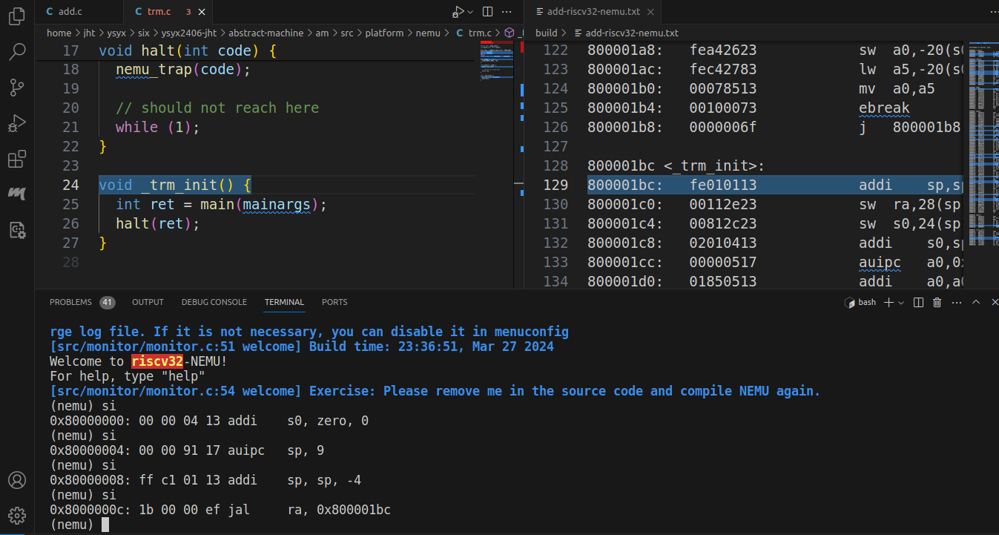

# ysyx-sdb-tui README

The ysyx-sdb-tui is a extension for NEMU or NPC SDB debugging tool. It can make the SDB support TUI mode in Visual Studio Code.



It can highlight the source code and disassembly code.

## Dependencies

To use this extension, you need to add interface to NEMU or NPC. The source code and guide is in [another repository](https://github.com/CSerht/ysyx-sdb-tui-client).

And you should use `apt install gdb-multiarch` to install the gdb-multiarch tool.

> NOTE: the extension is tested in the following environment: 
> **user:~$ gdb-multiarch --version**
> **GNU gdb (Ubuntu 12.1-0ubuntu1~22.04) 12.1**

For other versions of gdb or other Linux distributions, the compatibility is not guaranteed. The extension use **GDB/MI**, so as long as the commands and output are the same, it should be work.

**If you have any problems, please submit an issue.**

## User Guide

1. Install this extension from the marketplace. Search for `ysyx-sdb-tui`.
2. Type `Ctrl+Shift+P` to open the command palette.
    - Type `ysyx sdb tui Enable` and press `Enter` to enable the extension.
    - Type `ysyx sdb tui Disable` and press `Enter` to disable the extension.
3. Run you NEMU or NPC program in the VSCode terminal in SDB debug mode. **To enable TUI mode for NEMU or NPC, please refer to this [repository](https://github.com/CSerht/ysyx-sdb-tui-client)**. 

### Commands

After you enable the extension, it will open a socket server in the background. You can send the following commands to the server for control.

- `init [disas|gdb] file-path`: set the disassembly file path and elf file path. Note that the elf file shall contain the debug information, you can add `-g` or `-ggdb` option when you compile the program.
    - file-path: the absolute path of the file.
- `hl [disas|src|all] addr`: highlight the disassembly code or source code based on the address.
    - addr: the address of the `pc` register.
    - all: concurrently execute the `hl disas addr` and `hl src addr` commands. Recommended! Performance is better.

The extension use the `socket.io-server` to communicate with other programs. You can use the `socket.io-client` to send the commands. 

You can refer to the following links for more information:

* [Socket.IO Documentation](https://socket.io/docs/v4/)
* [C++ Socket.IO Client](https://github.com/socketio/socket.io-client-cpp?tab=readme-ov-file)

### Advanced Usage

In fact, you can use your own `socket.io` client to send the commands to the server. See the `SOCKET.IO` documentation for more information.

You can use the following order:

First, initialize the `socket.io` client and connect to the server.

Second, send commands to the server.

1. `init disas file-path`: set the disassembly file path.

2. `init gdb file-path`: set the elf file path, note that the elf file shall contain the debug information.

3. `hl disas addr` or `hl src addr`: set them to the proper location. 

Finally, close the connection.

## Extension Settings

You can set the socket server port in the `settings.json` file, default is 49159.

```json
{
    "ysyxSdbTui.serverPort": 49159
}
```

If you modify the port, you should restart the extension and **modify the client port in the NEMU or NPC**.

## Known Issues

If you have any problems, please let me know.

## Release Notes

The initial release of ysyx-sdb-tui.

### 0.0.1

The first release of ysyx-sdb-tui. Maybe it's not perfect, but it's a start.

### 0.0.2

Add icon and description.

### 0.0.3

Optimize the performance.

### 0.1.0

1. Use GDB/MI to communicate with the GDB. It has better compatibility and performance.

2. Add `breakpoint` support. 
    - You can set the breakpoint in the source code and disassembly code in VS Code. And it will send the information to the client.
    - The information of all breakpoints will be **stored** in the `breakpoints.json` file in the `build` directory that is the same as the elf file. So you can **recover** the breakpoints when you restart the program.

---

## Developer's Guide

You should install the `socket.io` package in your project.

```
npm install socket.io
npm install @types/socket.io
```
> TODO ...

## References

* [One Student One Chip Program](https://ysyx.oscc.cc/)
* [VS Code API](https://code.visualstudio.com/api/references/vscode-api)